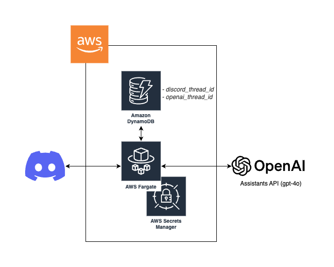

# Chappy - Discord AI Chat BOT

[Install Here](https://discord.com/oauth2/authorize?client_id=1152630659777572926)

Chappy is a Discord AI chat bot designed to explore how people interact with AI. It is free to use, but please note that all conversations are recorded and analyzed for research purposes. The availability of this edition is subject to change without notice. You can also self-host this bot.

## Self-Hosting



### OpenAI

1. Obtain an [API Key](https://platform.openai.com/api-keys). (`OPENAI_API_KEY`)
2. Create an [Assistant](https://platform.openai.com/assistants) and obtain an ID that starts with `asst..`. (`OPENAI_ASSISTANT_ID`)

### Discord

1. Create an [Application](https://discord.com/developers/applications) and configure it as follows:

- Installation >
  - Authorization Methods: Guild Install
  - Default Install Settings > Guild Install
    - SCOPES: `applications.commands` (default), `bot`
    - PERMISSIONS: `Add Reactions`, `Attach Files`, `Create Public Threads`, `Embed Links`, `Manage Messages`, `Manage Threads`, `Read Message History`, `Send Messages`, `Send Messages in Threads`
- Bot > Privileged Gateway Intents > MESSAGE CONTENT INTENT > (enable)

Refer to [Discord Permissions](https://discord.com/developers/docs/topics/permissions) for more details.

2. Use the Install Link to add the bot to your desired Discord server.
3. Obtain the Bot TOKEN (DISCORD_BOT_TOKEN) from the Bot settings.

With these settings, you can confirm the bot is operational by running the following commands:

```sh
export DISCORD_BOT_TOKEN='...'
export OPENAI_API_KEY='sk-...'
export OPENAI_ASSISTANT_ID='asst_...'
npm install
npx tsx src/index.ts
```

### AWS

1. Set up Secrets Manager:

```sh
npm install
npm run cdk deploy ChatGptDiscordBotSecretStack
```

2. Configure the [created Secrets Manager](https://console.aws.amazon.com/secretsmanager/listsecrets) with the necessary credentials.

```json
{
  "DISCORD_BOT_TOKEN": "...",
  "OPENAI_API_KEY": "sk-...",
  "OPENAI_ASSISTANT_ID": "asst_..."
}
```

3. Deploy the BOT.

```sh
npm run cdk deploy ChatGptDiscordBotStack
```

For any questions or further assistance, contact [@sola_vrc](https://x.com/sola_vrc).
